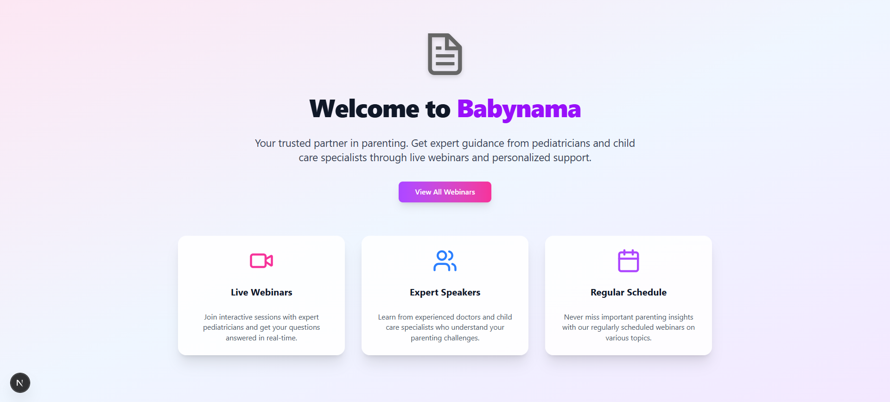
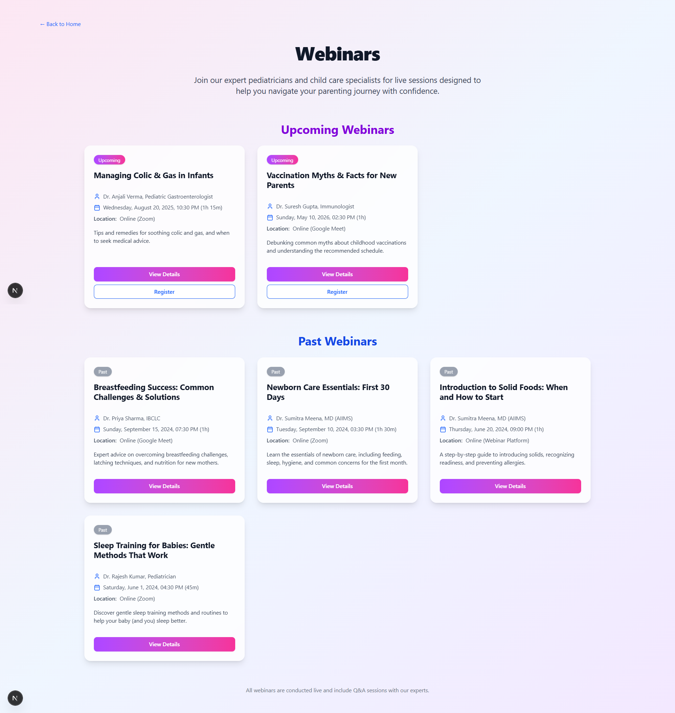
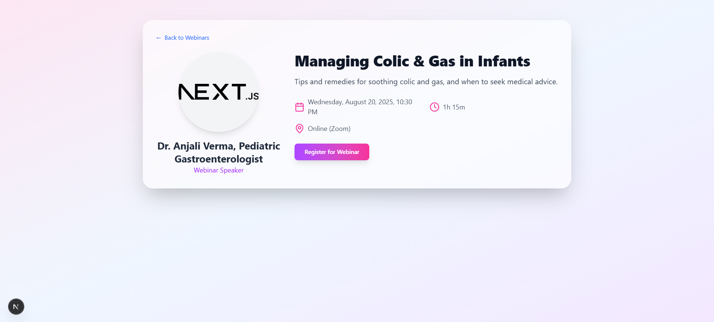
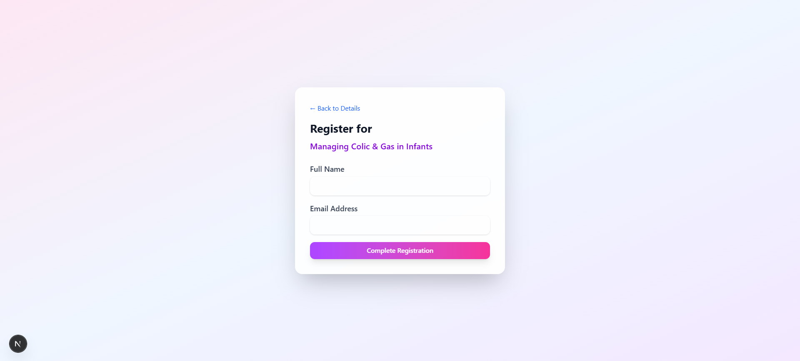
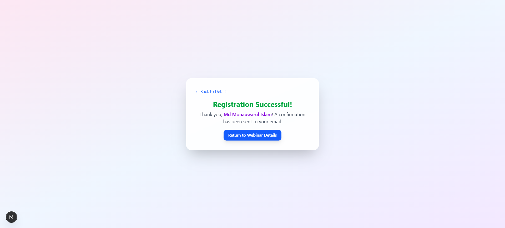

# Babynama - Frontend Developer Intern Assignment

Welcome to my submission for the Babynama internship assignment. This project simulates a real-world feature development task using **Next.js** and **React.js**, with a focus on clear UI, modular code, and developer mindset.

---

## Objective

**Build a feature in Next.js that shows a list of upcoming and past webinars on a dedicated page.**

---

## User Story

> “As a busy parent exploring Babynama's resources, I want to see a simple, clear list of upcoming live webinars on a dedicated page so I can quickly see what's available.”

---

## Live URL

**Vercel Deployment:**  
👉 [https://your-vercel-url.vercel.app/webinars](https://babynama-intern-assigment.vercel.app/)

---

## 📷 Screenshot







---

## Features Implemented

### 📄 1. `/webinars` Route
Created a new route `/webinars` that displays a structured, styled page containing:

---

### Upcoming Webinars
- Mock data array stored in `lib/webinar-data.ts`
- Each webinar card shows:
  - Title
  - Speaker
  - Date
  - “View Details” button that logs the `id` in the console

---

### Past Webinars (Extra Feature)
- A separate section displays a static list of previously hosted webinars
- Helpful for users who want to review past content or see speaker history

---

### Register for Webinar (Extra Feature)
- A **simple form** below the upcoming webinars section
- Allows parents to enter:
  - Name
  - Email
- Currently logs submitted data in the console for demo purposes

---

### Button Interactivity
Each webinar card includes a “View Details” button that logs the webinar ID:

Viewing details for webinar ID: 2
````


## Technical Choices Made

* **Componentization:** Used a `WebinarCard` component to keep the UI modular and clean.

* **Tailwind CSS:** Chosen for rapid, utility-first styling.

* **Data Separation:** Moved webinar data to `lib/webinar-data.ts` for better maintainability.

* **UI Enhancements:** Added headings, sections, and dividers to clearly distinguish upcoming, past, and form components.

* **App Directory:** Followed Next.js 13+ app directory structure for modern best practices.

---

## Roadblock & Learning

### Problem 1: Passing Data to `onClick`

Initially forgot the correct syntax for passing parameters inside `.map()` callbacks.

### Solution

Used an arrow function wrapper in `onClick`:

```tsx
<button onClick={() => handleViewDetails(webinar.id)}>View Details</button>
```

---

### Problem 2: Structuring Webinar Data

At first, I kept the array inline. Later realized that using `lib/webinar-data.ts` improved code readability and structure.

```ts
// lib/webinar-data.ts
export const webinars = [
  { id: 1, title: "Caring for Newborns", speaker: "Dr. Sumitra Meena", date: "2025-06-25" },
  ...
];
```

---

## Tech Stack

* Next.js 13+
* React.js
* Tailwind CSS
* TypeScript
* Vercel (deployment)

---


---

## 🖥️ How to Run Locally

### 1. Clone the Repository

```bash
git clone https://github.com/mdmonauwarulislam/babynama-intern-assigment.git
cd babynama-intern-assignment
```

### 2. Install Dependencies

```bash
npm install
```

### 3. Start Development Server

```bash
npm run dev
```

### 4. Open in Browser

Go to [http://localhost:3000/webinars](http://localhost:3000/webinars)

---

## 🙌 Thank You!

Thank you **Babynama** team for this opportunity. I enjoyed implementing this feature-rich assignment and adding thoughtful improvements. Looking forward to your feedback!

> Submitted by: **Md Monauwarul Islam**
> GitHub: [@mdmonauwarulislam](https://github.com/mdmonauwarulislam)

```
